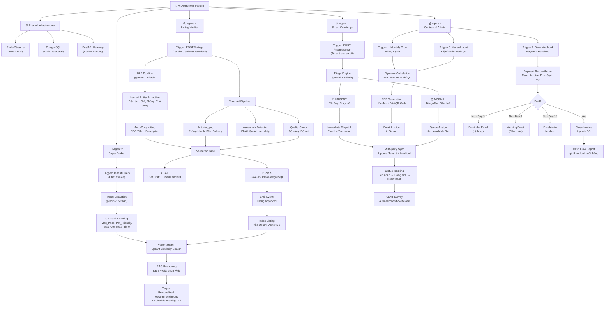

# 🏢 AI-Integrated Apartments — 4-Agent System Design

> **Status:** Design Phase — Pending Implementation Approval  
> **Scale:** 100 căn hộ / 1,000 users  
> **LLM:** gemini-1.5-flash | **Event Bus:** Redis Streams | **Vector DB:** Qdrant

---

## 📐 PHẦN 1 — System Architecture Overview

### Triết lý kiến trúc

Bốn agent hoạt động **độc lập** (loosely coupled) nhưng **phối hợp** qua Redis Streams event bus.  
Mỗi agent là một **FastAPI service riêng** (hoặc module riêng trong monorepo), có thể deploy và scale độc lập.

```
┌─────────────────────────────────────────────────────────┐
│                    CLIENT LAYER                         │
│  Landlord App     Tenant Chat     Admin Dashboard       │
└────────────┬────────────┬─────────────┬────────────────┘
             │            │             │
             ▼            ▼             ▼
┌─────────────────────────────────────────────────────────┐
│              FastAPI Gateway (Shared)                   │
│         Auth · Rate Limit · Request Routing             │
└──┬─────────────┬──────────────┬──────────────┬──────────┘
   │             │              │              │
   ▼             ▼              ▼              ▼
┌──────┐    ┌──────┐      ┌──────┐      ┌──────┐
│Agent1│    │Agent2│      │Agent3│      │Agent4│
│Listing    │Super │      │Smart │      │Contract
│Verif.│    │Broker│      │Conci.│      │&Admin│
└──┬───┘    └──┬───┘      └──┬───┘      └──┬───┘
   │           │              │              │
   └─────────────────┬────────────────────────┘
                     ▼
         ┌───────────────────────┐
         │   Redis Streams       │
         │   (Shared Event Bus)  │
         └───────────┬───────────┘
                     │
        ┌────────────┴───────────┐
        ▼                        ▼
┌───────────────┐      ┌──────────────────┐
│  PostgreSQL   │      │  Qdrant Vector   │
│  (Main DB)    │      │  (Agent 2 only)  │
└───────────────┘      └──────────────────┘
```

---

## 🌳 PHẦN 2 — Full Workflow Tree



---

## 📡 PHẦN 3 — Redis Streams Event Map

Đây là bản đồ tất cả các **events** lưu chuyển qua Redis Streams:

| Stream Name | Producer | Consumer | Payload |
|---|---|---|---|
| `listing.approved` | Agent 1 | Agent 2 | `{listing_id, embedding_data, metadata}` |
| `listing.rejected` | Agent 1 | — | `{listing_id, reason, landlord_email}` |
| `viewing.scheduled` | Agent 2 | Agent 3 | `{tenant_id, listing_id, datetime}` |
| `maintenance.created` | Agent 3 | — | `{ticket_id, severity, unit_id}` |
| `maintenance.completed` | Agent 3 | Agent 4 | `{ticket_id, cost, unit_id}` |
| `invoice.generated` | Agent 4 | — | `{invoice_id, tenant_id, amount, pdf_url}` |
| `payment.received` | Agent 4 | — | `{invoice_id, amount, timestamp}` |

---

## 🗂️ PHẦN 4 — Folder Structure (Monorepo)

```
fastapi-ai-engine/
├── app/
│   ├── core/
│   │   ├── config.py              # Settings, env vars (load từ .env)
│   │   ├── database.py            # PostgreSQL connection (SQLAlchemy engine)
│   │   ├── redis_streams.py       # Event bus client — publish/consume events (shared)
│   │   └── gemini_client.py       # Shared Gemini SDK client (gemini-1.5-flash)
│   │
│   ├── agents/
│   │   ├── listing_verifier/      # Agent 1 — Kiểm duyệt & chuẩn hóa bất động sản
│   │   │   ├── prompts.py         # Prompt NLP extraction + Auto-copywriting SEO
│   │   │   ├── router.py          # FastAPI routes: POST /listings
│   │   │   ├── nlp_pipeline.py    # Trích xuất thực thể (diện tích, giá, phòng, thú cưng)
│   │   │   ├── vision_pipeline.py # Auto-tagging ảnh, kiểm tra chất lượng, watermark
│   │   │   └── service.py         # Orchestration: gọi NLP + Vision → validate → emit event
│   │   │
│   │   ├── super_broker/          # Agent 2 — Tìm kiếm & tư vấn ngữ cảnh cho khách thuê
│   │   │   ├── prompts.py         # Prompt intent extraction + RAG reasoning explanation
│   │   │   ├── router.py          # FastAPI routes: POST /search, POST /schedule
│   │   │   ├── intent_extractor.py# Parse câu hỏi → constraints (giá, vị trí, thú cưng)
│   │   │   ├── qdrant_service.py  # Kết nối Qdrant: index listing + vector search
│   │   │   ├── rag_engine.py      # Reasoning: kết hợp kết quả search + giải thích lý do
│   │   │   └── service.py         # Orchestration: query → search → reason → respond
│   │   │
│   │   ├── smart_concierge/       # Agent 3 — Quản gia sự cố & điều phối bảo trì
│   │   │   ├── prompts.py         # Prompt phân loại mức độ nghiêm trọng (URGENT/NORMAL)
│   │   │   ├── router.py          # FastAPI routes: POST /maintenance, PATCH /tickets/{id}
│   │   │   ├── triage_engine.py   # Phân loại sự cố + xác định mức độ ưu tiên
│   │   │   ├── dispatcher.py      # Gửi email thông báo cho kỹ thuật viên (SMTP)
│   │   │   └── service.py         # Orchestration: triage → assign → sync status → CSAT
│   │   │
│   │   └── contract_admin/        # Agent 4 — Kế toán & hợp đồng tự động
│   │       ├── prompts.py         # Prompt sinh nội dung email nhắc nợ (lịch sự / cảnh báo)
│   │       ├── router.py          # FastAPI routes: POST /invoices, POST /webhook/payment
│   │       ├── billing_engine.py  # Tính hóa đơn: điện + nước + phí quản lý theo hợp đồng
│   │       ├── pdf_generator.py   # Render PDF hóa đơn đính kèm mã VietQR
│   │       ├── vietqr_service.py  # Tạo mã QR thanh toán theo chuẩn VietQR
│   │       ├── reconciliation.py  # Lắng nghe webhook ngân hàng → gạch nợ tự động
│   │       ├── dunning.py         # Chuỗi nhắc nợ tự động: ngày 3 → 7 → 14
│   │       └── service.py         # Orchestration: billing cycle + payment flow + report
│   │
│   ├── schemas/                   # Pydantic schemas — validate I/O contract với NestJS & internal agents
│   │   │
│   │   ├── schema_verifier.py     # ✅ Agent 1 — Listing Verifier (đã có)
│   │   │   # INPUT
│   │   │   # ├── rawListingInput          → Text thô từ NestJS + owner_id + db_apartment_data (đối soát)
│   │   │   # OUTPUT
│   │   │   # ├── listingCoreOutput        → title SEO, description chuẩn, price_per_month, status
│   │   │   # ├── amenityItem              → Tiện nghi phân loại: furniture / building / policy
│   │   │   # ├── apartmentMetaOutput      → area_m2, floor, room_number, note, amenities[]
│   │   │   # ├── validationOutput         → score(0-100), data_conflicts, missing_fields, feedback_to_owner
│   │   │   # ├── listingVerifiedOutput    → Root output: listing + apartment_meta + image_tags + validation
│   │   │   # └── verifyListingResponse    → HTTP wrapper: {success, data, error}
│   │   │
│   │   ├── schema_broker.py       # 🔵 Agent 2 — Super Broker
│   │   │   # INPUT
│   │   │   # ├── searchQueryInput         → query (ngôn ngữ tự nhiên), tenant_id, conversation_history[]
│   │   │   # ├── extractedConstraints     → max_price, min_price, pet_friendly, max_commute_min, districts[]
│   │   │   # OUTPUT
│   │   │   # ├── listingMatch             → listing_id, score, reasoning (lý do phù hợp bằng tiếng Việt)
│   │   │   # ├── searchResultOutput       → top_matches[listingMatch], summary, suggested_schedule_url
│   │   │   # └── brokerResponse           → HTTP wrapper: {success, data, error}
│   │   │
│   │   ├── schema_concierge.py    # 🔧 Agent 3 — Smart Concierge
│   │   │   # INPUT
│   │   │   # ├── maintenanceRequestInput  → tenant_id, unit_id, description, image_urls[], reported_at
│   │   │   # ├── ticketStatusUpdate       → ticket_id, new_status, updated_by, note
│   │   │   # OUTPUT
│   │   │   # ├── severityLevel (Enum)     → URGENT | NORMAL
│   │   │   # ├── ticketStatus (Enum)      → PENDING | ASSIGNED | IN_PROGRESS | COMPLETED
│   │   │   # ├── triageOutput             → severity, priority_score, classification_reason
│   │   │   # ├── maintenanceTicketOutput  → ticket_id, severity, assigned_to, status, eta
│   │   │   # ├── csatSurveyOutput         → ticket_id, rating(1-5), comment, submitted_at
│   │   │   # └── conciergeResponse        → HTTP wrapper: {success, data, error}
│   │   │
│   │   └── schema_admin.py        # 💰 Agent 4 — Contract & Admin
│   │       # INPUT
│   │       # ├── utilityReadingInput      → unit_id, month, year, electricity_kwh, water_m3
│   │       # ├── paymentWebhookInput      → invoice_id, amount, bank_ref, transaction_time, bank_code
│   │       # OUTPUT
│   │       # ├── billingItem              → label (Điện/Nước/Phí QL), unit_price, quantity, subtotal
│   │       # ├── invoiceOutput            → invoice_id, tenant_id, items[], total, due_date, pdf_url, vietqr_payload
│   │       # ├── dunningStage (Enum)      → REMINDER(day 3) | WARNING(day 7) | ESCALATE(day 14)
│   │       # ├── reconciliationOutput     → invoice_id, matched, paid_amount, remaining, closed_at
│   │       # └── adminResponse            → HTTP wrapper: {success, data, error}
│   │
│   ├── models/                    # SQLAlchemy ORM models (shared across agents)
│   │   ├── listing.py             # Bất động sản: địa chỉ, giá, nội thất, trạng thái
│   │   ├── tenant.py              # Khách thuê: thông tin cá nhân, hợp đồng liên kết
│   │   ├── invoice.py             # Hóa đơn: kỳ thanh toán, trạng thái, PDF URL
│   │   └── maintenance.py         # Ticket bảo trì: mức độ, trạng thái, CSAT score
│   │
│   └── main.py                    # FastAPI app entry — mount tất cả agent routers
│
├── workers/
│   ├── stream_consumer.py         # Redis Streams consumer — lắng nghe và dispatch events
│   └── cron_scheduler.py          # Cron job — kích hoạt billing cycle hàng tháng
│
├── docker-compose.yml             # Khởi động: PostgreSQL + Redis + Qdrant (local dev)
└── requirements.txt               # Dependencies: fastapi, google-generativeai, qdrant-client...
```

---

## ⚙️ PHẦN 5 — Tech Stack Summary

| Layer | Technology | Ghi chú |
|---|---|---|
| API Framework | FastAPI | Đang dùng |
| LLM | gemini-1.5-flash | Tất cả 4 agents |
| Agent Framework | Google Gemini Agent | Agents 2, 3, 4 |
| Vector Database | Qdrant | Agent 2 only |
| Main Database | PostgreSQL | Shared |
| Event Bus | Redis Streams | Shared |
| PDF Generation | WeasyPrint / ReportLab | Agent 4 |
| QR Code | VietQR standard | Agent 4 |
| Email | SMTP (smtplib / FastMail) | Agents 3, 4 |
| Container | Docker Compose | Local dev |

---

## 🔐 PHẦN 6 — Non-Functional Requirements

| Requirement | Value | Notes |
|---|---|---|
| Availability | 99% | Không cần HA phức tạp ở scale này |
| Response time (Agent 2) | < 3s | Chat UX yêu cầu |
| Response time (Agent 1) | < 30s | Vision AI + NLP pipeline |
| Data retention | 5 years | Hợp đồng, hóa đơn |
| Security | JWT Auth | Phân quyền landlord/tenant/admin |
| Privacy | Dữ liệu khách thuê | Không share giữa chủ nhà khác nhau |

---

## 📝 Decision Log

| # | Quyết định | Thay thế đã xét | Lý do chọn |
|---|---|---|---|
| D1 | Redis Streams làm event bus | Celery, Google Pub/Sub | Nhẹ nhất, đủ scale, không over-engineer |
| D2 | Qdrant làm vector DB | pgvector, Pinecone | Dedicated vector DB, dễ self-host, free |
| D3 | gemini-1.5-flash | GPT-4, Claude | Đồng bộ Google ecosystem, cost-effective |
| D4 | Email SMTP cho Agent 3 | Zalo OA, Telegram | Đơn giản nhất, đủ dùng giai đoạn đầu |
| D5 | Monorepo | Microservices riêng | Scale 100 căn → không cần complexity của microservices |

---

## 🚀 Implementation Roadmap

### Phase 1 — Foundation (Tuần 1–2)
- [x] Agent 1: Listing Verifier (đang xây)
- [ ] Setup Redis Streams client (shared)
- [ ] Setup Qdrant (Docker)
- [ ] Emit `listing.approved` event từ Agent 1

### Phase 2 — Agent 2 (Tuần 3–4)
- [ ] Qdrant indexing consumer (nhận `listing.approved`)
- [ ] Intent extraction với gemini-1.5-flash
- [ ] Vector search + RAG reasoning
- [ ] Chat API endpoint

### Phase 3 — Agent 3 (Tuần 5–6)
- [ ] Triage engine với Gemini
- [ ] Email SMTP dispatcher
- [ ] Ticket status tracking
- [ ] CSAT auto-send

### Phase 4 — Agent 4 (Tuần 7–8)
- [ ] Billing calculation engine
- [ ] PDF generation + VietQR
- [ ] Bank webhook receiver
- [ ] Dunning automation (3-7-14 day sequence)

